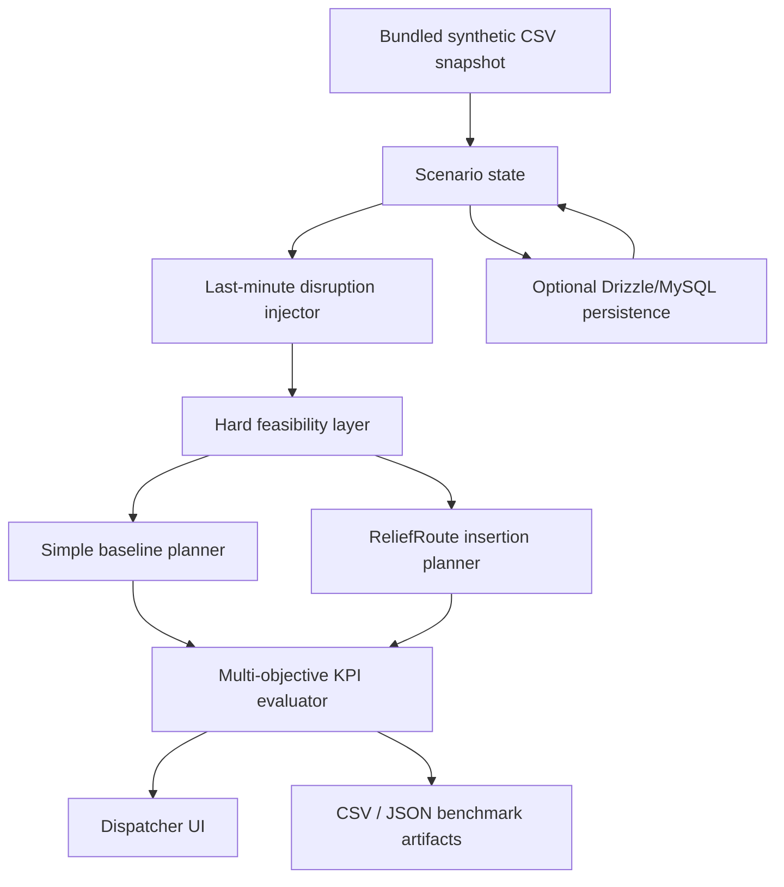

# ReliefRoute architecture

## Runtime path

1. The UI loads a deterministic operational snapshot.
2. A dispatcher injects a disruption.
3. The disruption mutates only the simulation copy.
4. Completed work is preserved.
5. Hard constraints filter candidate vehicles.
6. Baseline and adaptive planners produce independent plans from the same state.
7. The KPI evaluator measures service, commitments, distance, cost, emissions, late stops, reliability, stability and utilisation.
8. The UI exposes the plan and decision trace.

## Infrastructure choice

The default path is local-first. It does not require a live map provider, GPS stream, database or optimisation cluster. The Drizzle/MySQL schema provides a production persistence path without making the benchmark dependent on it.
